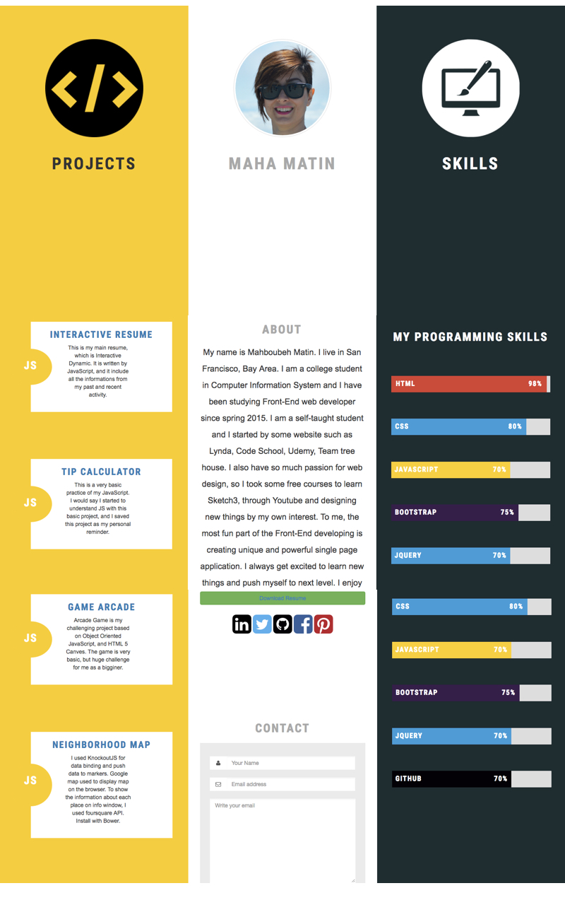

# Portfolio-Site
This is my personal website. I built it from scratch. As I took some design course such as Sketch, I mockup this website as my hobby. I convert the whole mockup to HTML and CSS.
Basically I used HTML5, CSS3, and Bootstrap. But I made it full responsive with any type of device. In fact all the images and text are also responsive.

In the left pallet of website you can see all project I have done recently. By clicking on them, you can run the APP.

This is the screenshot of my website:

